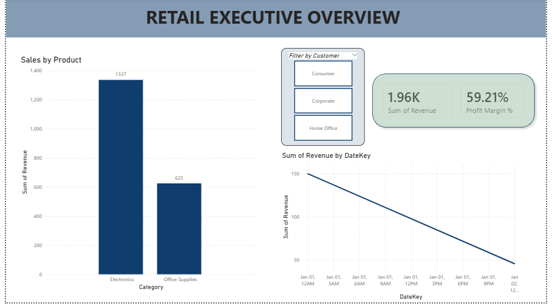

# Project Title: Executive Retail Sales & Profitability Dashboard

**Project Desciption** 
I developed an end-to-end business intelligence solution to transform raw transactional data into actionable executive insights. The project involved architecting a relational database, performing ETL, and designing a high-fidelity dashboard for a retail environment.

**Tools Used**
- SQL Server (T-SQL)
- Power BI Desktop
- DAX

**Technical Highlights**
| Components | Description |
| :---: | :---: |
| Database Design | Built a Star Schema with 1 Fact table (Fact_Sales) and 3 Dimension tables (Product, Customer, Date) to optimize query performance and reporting. |
| Data Modeling | Established one-to-many relationships and a custom Date Hierarchy to enable time-intelligence "Drill Down" capabilities. |
| Advanced Analytics (DAX) | Created custom measures including Profit Margin % using complex logical functions (DIVIDE, SUM) to track business health beyond top-line revenue. |
| UI/UX Design | Implemented a Card-UI layout with interactive slicers and cross-filtering to provide a seamless user experience for stakeholders. |

**Power BI Dasboard** 

